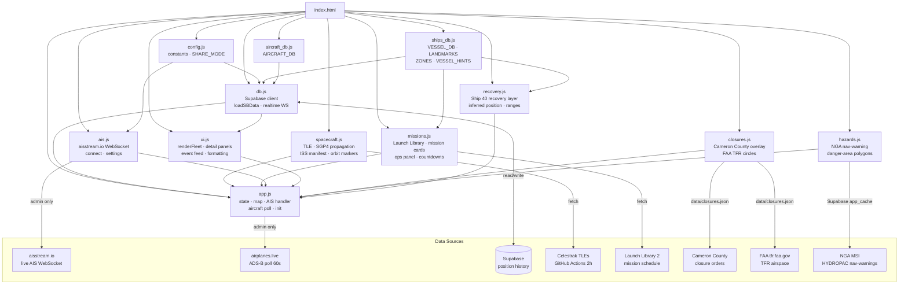

# Space Fleet Tracker

Real-time map of every vessel, aircraft, and spacecraft supporting commercial space launch operations — SpaceX, Blue Origin, Rocket Lab, ULA, NASA, and more.

**[→ Open the live tracker](https://karl-dykema.github.io/space-intel/?share)**

---

## What it tracks

**Vessels (AIS)** — drone ships, fairing catchers, Dragon recovery ships, support tugs, and range instrumentation ships. Positions update in real-time via AIS transponders.

**Aircraft (ADS-B)** — SpaceX executive jets, NASA research aircraft (WB-57F, ER-2, X-59), Rocket Lab's capture helicopter, Draken International adversary trainers, and more.

**Spacecraft (TLE)** — ISS, Tiangong, active Dragon and Cygnus capsules, Soyuz, Shenzhou, and other crewed/cargo vehicles in orbit, updated every 15 seconds from Celestrak TLE data.

**Launches** — upcoming missions from the Launch Library API with countdowns, trajectory arcs computed from actual orbital inclination, and vessel-mission linkage showing which ship is assigned to each booster recovery.

**Road & airspace closures** — Cameron County Hwy 4 / Boca Chica Beach closure orders (map overlay + badge), and FAA Temporary Flight Restrictions (TFR circles) — both scraped on a smart schedule that increases frequency within 48 hours of a launch.

**Maritime hazard zones** — launch danger areas parsed from NGA HYDROPAC/HYDROLANT broadcast nav-warnings and drawn as polygons on the map.

**Recovery operations** — live overlay for at-sea recovery efforts, currently the Starship Ship 40 tow attempt in the Indian Ocean (see [Ship 40 recovery](#ship-40-recovery-operation)).

---

## Architecture

**Load order** (left to right in `index.html`):  
`config` → `ships_db` → `aircraft_db` → `db` → `spacecraft` → `missions` → `ais` → `ui` → `closures` → `hazards` → `recovery` → `app`

**Share mode** (`?share`): Supabase is the only position data source. AIS WebSocket never connects. All `db.js` update conditions start with `SHARE_MODE ||` so the shared page stays live via 15s poll + realtime subscription. Closure/TFR data comes from the static `data/closures.json` file — no admin proxy required on the share page.

---

## Fleet

### SpaceX — Vessels
| Vessel | Role |
|--------|------|
| A Shortfall of Gravitas (ASOG) | Autonomous drone ship — East Coast (LC-39A, SLC-40) |
| Of Course I Still Love You (OCISLY) | Autonomous drone ship — West Coast (Vandenberg SLC-4E) |
| Just Read the Instructions (JRTI) | Drone ship / Starship program support (Boca Chica) |
| Shannon | Dragon capsule recovery |
| Bob | Fairing recovery / ASOG support |
| Doug | Fairing recovery / ASOG support |
| Finn Falgout | Primary East Coast drone ship tug |

### SpaceX — Starbase Fleet
| Vessel | Role |
|--------|------|
| Jacklyn | JRTI tug / Starship recovery support |
| GO Searcher / GO Navigator | Starship splashdown crew recovery |
| Seaworker | Offshore supply, Starship hardware transport |
| Star Gazer | Range safety / chase vessel |

### SpaceX — Starship Indian Ocean Recovery (Flight 13, active)
| Vessel | Role |
|--------|------|
| Go Australis | Landing-zone support; station-keeping alongside Ship 40 |
| Normand Ranger | Tow vessel — Solstad AHTS, 280 t bollard pull |
| Skimmer Tide | Rigging/crew support — Tidewater PSV |

### Blue Origin
| Vessel | Role |
|--------|------|
| Jacklyn (BO) | New Glenn booster recovery |

### Rocket Lab
| Vessel | Role |
|--------|------|
| Rocket Lab Recovery Vessel | Electron booster offshore recovery |

---

## Features

- **Live AIS** via [aisstream.io](https://aisstream.io) WebSocket — global coverage, all tracked MMSIs
- **Live ADS-B** via [airplanes.live](https://airplanes.live) — polled every 60 seconds (admin only); share page gets aircraft positions from Supabase
- **GPS trails** — up to 3 days of position history per vessel loaded from Supabase on page load; live track appended in real-time
- **Orbital tracking** — TLE propagation via satellite.js, positions updated every 15 seconds
- **Mission linkage** — [Launch Library 2](https://thespacedevs.com) data links vessels to assigned missions; trajectory arcs use real orbital inclination
- **Booster projections** — estimated drone ship arrival computed from mission timing and live vessel position
- **Events feed** — automatic zone enter/exit, vessel underway/moored, destination changes
- **Boca Chica closures** — Cameron County Hwy 4 / beach closure orders shown as map overlay and top-of-map badge; polling rate increases to every 2h within 48h of a launch
- **FAA TFR overlay** — active Temporary Flight Restrictions shown as circles on the map; SpaceX/Starship TFRs highlighted in cyan
- **Maritime hazard zones** — launch danger areas from NGA HYDROPAC/HYDROLANT nav-warnings drawn as dashed polygons
- **Ship 40 recovery layer** — live range, bearing, and ETA from each flotilla vessel to the drifting Starship, plus time-afloat counter (see below)
- **Share mode** — clean public URL (`?share`) with no API keys required
- **Supabase sync** — position history survives page reloads; share page stays within ~15 seconds of admin
- **Tab leader election** — multiple open tabs coordinate so only one writes to Supabase, preventing duplicate position entries

---

## Ship 40 recovery operation

On 24 July 2026, Starship Flight 13 executed a soft splashdown in the Indian Ocean off NW Australia and **came to rest intact** — the first Starship ever to survive and float. SpaceX chartered a three-vessel flotilla to attempt the first at-sea recovery of a Starship.

Toggle the layer with the amber **SHIP 40 RECOVERY** button.

**How the Ship 40 marker works — important:** Ship 40 carries no AIS transponder, so it **cannot be tracked directly**. Its position is *inferred* from Go Australis, which has been station-keeping alongside since splashdown. The marker is drawn as a hollow diamond (deliberately unlike a vessel marker) and every tooltip states the position is inferred. If the escort's own position goes stale (>2h) the marker dims and says so. This is a proxy, not a fix.

The layer also shows range/bearing from each inbound vessel, ETA (only when a vessel is actually making way), distance to Dampier, and a time-afloat counter.

**Why a tow, and why it's hard.** Heavy-lift and crane recovery are both effectively impossible in open ocean — those are millimetre-precision operations needing sheltered water and pre-built cradle blocks. That leaves a tow. The limiting factor is *not* pulling power (280 t bollard pull is ample) but **attachment**: Ship 40 has no designed tow points, so a bridle must be rigged to pull from a centre point, or the hull yaws and sheers. It also floats very high with little below the waterline, giving wind enormous leverage. The stainless-steel hull at least permits welding attachment points, though doing that from small boats alongside a pitching object at sea is the hazardous part.

**Status — under tow (as of 2 August 2026).** Normand Ranger rigged a bridle and has Ship 40 under tow, bound for Western Australia. The tow is the first ever attempted on a Starship. At a tow speed of ~3 kn, arrival at Dampier lands around 11–12 August UTC.

The operation phase is set by hand in `recovery.js` (`RECOVERY_OP.phase`) because it comes from reporting, not telemetry. It controls which vessel proxies Ship 40's position: while adrift that was Go Australis station-keeping alongside; under tow it is Normand Ranger, with Ship 40 a few hundred metres astern on the wire.

*This layer is intentionally time-boxed. When the tow concludes, delete `recovery.js`, its `<script>` tag, and the cbar button; demote the three MMSIs in `scripts/fetch-vapi.js`.*

---

## Using the tracker

The **[live link](https://karl-dykema.github.io/space-intel/?share)** requires no setup or login.

Toggle buttons at the top control **Landmarks & Facilities**, **Vessels**, **Aircraft**, **Spacecraft**, **Hazard Zones**, and **Ship 40 Recovery** layers. Click any element on the map or fleet list for details, specs, and mission history.

---

## Running your own instance

1. Fork this repo and enable GitHub Pages (`main` branch, root folder)
2. Get a free AIS key at [aisstream.io/authenticate](https://aisstream.io/authenticate)
3. Open the app, click **⚙ SETTINGS**, paste your key

**Optional — Supabase persistence:**
1. Create a free project at [supabase.com](https://supabase.com)
2. Run `supabase_schema.sql` in the SQL editor
3. Paste your URL and anon key in ⚙ SETTINGS

GitHub Actions handle TLE updates, vessel position snapshots, and closure/TFR data automatically — no additional configuration or secrets required for those.

---

## Files

| File | Description |
|------|-------------|
| `index.html` | App shell, layout, script load order |
| `config.js` | Supabase URL/key, SHARE_MODE flag, log colors |
| `ships_db.js` | VESSEL_DB, LANDMARKS, ZONES, VESSEL_HINTS, operator config |
| `aircraft_db.js` | AIRCRAFT_DB — all tracked aircraft registrations |
| `db.js` | Supabase REST client, loadSBData, realtime WebSocket, tab leader election |
| `spacecraft.js` | TLE fetch/propagation, orbit markers, ISS docked manifest |
| `missions.js` | Launch Library fetch, mission cards, ops panel, countdowns |
| `ais.js` | aisstream.io WebSocket, connect/disconnect, settings modal |
| `ui.js` | Fleet list, detail panels, event feed, formatting helpers |
| `closures.js` | Cameron County closure map overlay, FAA TFR circle overlays |
| `hazards.js` | NGA nav-warning danger-area polygons |
| `recovery.js` | Ship 40 at-sea recovery layer — inferred position, ranges, ETAs (temporary) |
| `app.js` | State, map init, AIS message handler, aircraft poll, init |
| `styles.css` | All styles |
| `supabase_schema.sql` | Database schema for position history and events |
| `proxy.js` | Local dev proxy — bridges AIS WebSocket, serves news RSS |
| `scripts/fetch-tles.js` | GitHub Actions: TLE updater (every 2h) |
| `scripts/fetch-vapi.js` | GitHub Actions: VesselAPI position snapshots (every 3 days, vessels tiered by activity) |
| `scripts/fetch-closures.js` | GitHub Actions: Cameron County + FAA TFR scraper (smart schedule) |
| `data/stations.tle` | Latest TLE data (auto-updated) |
| `data/vapi-positions.json` | Latest vessel position snapshots (auto-updated) |
| `data/closures.json` | Latest closure and TFR data (auto-updated) |

---

## Data sources

| Data | Source | Update frequency |
|------|--------|-----------------|
| Vessel positions | [aisstream.io](https://aisstream.io) | Live WebSocket |
| Vessel snapshots | [VesselAPI.com](https://vesselapi.com) | Every 3 days; active vessels every run, idle ones every 2nd (GitHub Actions) |
| Aircraft positions | [airplanes.live](https://airplanes.live) | Every 60s (admin) / Supabase (share) |
| Spacecraft TLEs | [Celestrak](https://celestrak.com) | Every 2h (GitHub Actions) |
| Launch schedule | [Launch Library 2](https://thespacedevs.com) | On page load, hourly cache |
| Road closures | [Cameron County, TX](https://www.cameroncountytx.gov/spacex/) | Daily / 2h near launch (GitHub Actions) |
| FAA TFRs | [FAA tfr.faa.gov](https://tfr.faa.gov) | Daily / 2h near launch (GitHub Actions) |
| Maritime nav-warnings | [NGA Maritime Safety Information](https://msi.nga.mil/NavWarnings) | Daily / 2h near launch (GitHub Actions) |

Vessel identification and tow analysis for the Ship 40 recovery draws on [What's Going on With Shipping](https://www.youtube.com/@wgowshipping) (Sal Mercogliano), a maritime historian covering the salvage and towing side of the operation.

---

## Contributing

MMSIs, aircraft registrations, and vessel details live in `ships_db.js` and `aircraft_db.js`. PRs and issues welcome — especially for:

- Support tugs and secondary vessels that are hard to verify
- New operator fleets (Firefly, Relativity, etc.)
- International launch support ships
- Corrections to vessel specs or history

**Verify MMSIs:** [marinetraffic.com](https://www.marinetraffic.com) · [vesselfinder.com](https://www.vesselfinder.com)  
**Verify registrations:** [FAA Registry](https://registry.faa.gov/aircraftinquiry) · [planespotters.net](https://www.planespotters.net)
