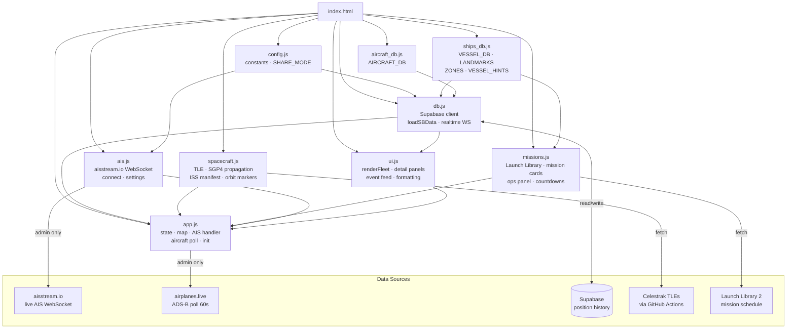

# Space Fleet Tracker

Real-time map of every vessel, aircraft, and spacecraft supporting commercial space launch operations — SpaceX, Blue Origin, Rocket Lab, ULA, NASA, and more.

**[→ Open the live tracker](https://karl-dykema.github.io/space-intel/?share)**

---

## What it tracks

**Vessels (AIS)** — drone ships, fairing catchers, Dragon recovery ships, support tugs, and range instrumentation ships. Positions update in real-time via AIS transponders.

**Aircraft (ADS-B)** — SpaceX executive jets, NASA research aircraft (WB-57F, ER-2, X-59), Rocket Lab's capture helicopter, Draken International adversary trainers, and more.

**Spacecraft (TLE)** — ISS, Tiangong, active Dragon and Cygnus capsules, Soyuz, Shenzhou, and other crewed/cargo vehicles in orbit, updated every 15 seconds from Celestrak TLE data.

**Launches** — upcoming missions from the Launch Library API with countdowns, trajectory arcs computed from actual orbital inclination, and vessel-mission linkage showing which ship is assigned to each booster recovery.

---

## Architecture

**Load order** (left to right in `index.html`):  
`config` → `ships_db` → `aircraft_db` → `db` → `spacecraft` → `missions` → `ais` → `ui` → `app`

**Share mode** (`?share`): Supabase is the only data source. AIS WebSocket never connects. All `db.js` update conditions start with `SHARE_MODE ||` so the shared page stays live via 15s poll + realtime subscription.

---

## Fleet

### SpaceX — Vessels
| Vessel | Role |
|--------|------|
| A Shortfall of Gravitas (ASOG) | Autonomous drone ship — East Coast (LC-39A, SLC-40) |
| Of Course I Still Love You (OCISLY) | Autonomous drone ship — West Coast (Vandenberg SLC-4E) |
| Just Read the Instructions (JRTI) | Drone ship / Starship program support (Boca Chica) |
| Shannon | Dragon capsule recovery |
| Bob | Fairing recovery / ASOG support |
| Doug | Fairing recovery / ASOG support |
| Finn Falgout | Primary East Coast drone ship tug |
| GO Beyond | West Coast OCISLY support vessel |
| Signet Warhorse I & II | Atlantic escort tugs |

### Blue Origin — Vessels
| Vessel | Role |
|--------|------|
| LPV-1 Jacklyn | New Glenn first-stage landing platform |
| Harvey Stone | Jacklyn support tug |

### Rocket Lab — Vessels
| Vessel | Role |
|--------|------|
| Seaworker | Electron booster recovery — Māhia, NZ |
| Sea Surveyor | Range support — Māhia, NZ |

### ULA / ESA / Other — Vessels
| Vessel | Role |
|--------|------|
| RocketShip | Delta IV / Vulcan component transport (ULA) |
| Delta Mariner | Heavy rocket component transport (ULA) |
| Canopée | Ariane 6 rocket transport (ArianeGroup) |
| MN Colibri / MN Toucan | Arianespace component transports |
| Once in a Lifetime | Sea-based mobile launch platform (The Spaceport Company) |

### US Space Force — Range Instrumentation
| Vessel | Role |
|--------|------|
| USNS Howard O. Lorenzen (T-AGM-25) | Cobra King radar — missile/range telemetry |
| USNS Invincible (T-AGM-24) | Range instrumentation ship |
| SBX-1 | Sea-based X-band radar (Pearl Harbor) |

### SpaceX — Aircraft
| Registration | Aircraft | Role |
|---|---|---|
| N628TS | Gulfstream G650ER | Executive transport |
| N8628 | Gulfstream G800 | Executive transport |
| N154TS | Boeing 737-800 | Personnel transport |
| N272BG / N502SX | Gulfstream G550 (×2) | Executive transport |
| N152QS | Gulfstream G450 | Executive transport |

### NASA — Aircraft
| Registration | Aircraft | Role |
|---|---|---|
| N926NA / N927NA / N928NA | WB-57F Canberra (×3) | High-altitude launch observation (60,000 ft+) |
| N806NA / N809NA | ER-2S (×2) | High-altitude Earth observation (70,000 ft+) |
| N559NA | X-59 QueSST | Quiet supersonic research — first supersonic flight 2026 |
| N941NA | Super Guppy | Oversized spacecraft component transport |
| N426NA | P-3B Orion | Airborne science |
| N917NA / N918NA / N960NA / N963NA / N966NA / N967NA | T-38 Talon fleet | Astronaut jet proficiency training |
| N908NA | T-38A | Research support — NASA Ames (Moffett Field) |
| N425NA / N435NA / N442NA | Airbus H135 (×3) | Security / rescue / VIP transport — KSC |

### Draken International / Jared Isaacman
| Registration | Aircraft | Role |
|---|---|---|
| N29UB / N229XX / N129XX | MiG-29UB (×3) | Adversary air training |
| N591EM / N592EM / N593EM | Northrop F-5E/F (×3) | Adversary air training |
| N572AJ / N512XA / N115AJ | Alpha Jet (×3) | Adversary air training |
| N136EM / N135EM / N138EM / N137EM | L-39 variants (×4) | Adversary air training |
| N82EM | Global Express | Executive transport |

### Rocket Lab — Aircraft
| Registration | Aircraft | Role |
|---|---|---|
| ZK-HEV | Sikorsky S-92A | Mid-air Electron booster catch off Māhia, NZ |

---

## Features

- **Live AIS** via [aisstream.io](https://aisstream.io) WebSocket — global coverage, all tracked MMSIs
- **Live ADS-B** via [airplanes.live](https://airplanes.live) — polled every 60 seconds (admin only); share page gets aircraft positions from Supabase
- **Orbital tracking** — TLE propagation via satellite.js, positions updated every 15 seconds
- **Mission linkage** — [Launch Library 2](https://thespacedevs.com) data links vessels to assigned missions; trajectory arcs use real orbital inclination
- **Booster projections** — estimated drone ship arrival computed from mission timing and live vessel position
- **Events feed** — automatic zone enter/exit, vessel underway/moored, destination changes
- **Share mode** — clean public URL (`?share`) with no API keys in the URL
- **Supabase sync** — position history survives page reloads; share page stays within ~15 seconds of admin

---

## Using the tracker

The **[live link](https://karl-dykema.github.io/space-intel/?share)** requires no setup or login.

Toggle buttons at the top control **Landmarks & Facilities**, **Vessels**, **Aircraft**, and **Spacecraft** layers. Click any element on the map or fleet list for details, specs, and mission history.

---

## Running your own instance

1. Fork this repo and enable GitHub Pages (`main` branch, root folder)
2. Get a free AIS key at [aisstream.io/authenticate](https://aisstream.io/authenticate)
3. Open the app, click **⚙ SETTINGS**, paste your key

**Optional — Supabase persistence:**
1. Create a free project at [supabase.com](https://supabase.com)
2. Run `supabase_schema.sql` in the SQL editor
3. Paste your URL and anon key in ⚙ SETTINGS

---

## Files

| File | Lines | Description |
|------|-------|-------------|
| `index.html` | ~255 | App shell, layout, script load order |
| `config.js` | ~18 | Supabase URL/key, SHARE_MODE flag, log colors |
| `ships_db.js` | ~876 | VESSEL_DB, LANDMARKS, ZONES, VESSEL_HINTS, operator config |
| `aircraft_db.js` | ~368 | AIRCRAFT_DB — all tracked aircraft registrations |
| `db.js` | ~232 | Supabase REST client, loadSBData, realtime WebSocket |
| `spacecraft.js` | ~862 | TLE fetch/propagation, orbit markers, ISS docked manifest |
| `missions.js` | ~669 | Launch Library fetch, mission cards, ops panel, countdowns |
| `ais.js` | ~126 | aisstream.io WebSocket, connect/disconnect, settings modal |
| `ui.js` | ~663 | Fleet list, detail panels, event feed, formatting helpers |
| `app.js` | ~747 | State, map init, AIS message handler, aircraft poll, init |
| `styles.css` | ~184 | All styles |
| `supabase_schema.sql` | — | Database schema for position history and events |
| `scripts/fetch-tles.js` | — | GitHub Actions TLE updater (runs every 2h) |

---

## Data sources

| Data | Source |
|------|--------|
| Vessel positions | [aisstream.io](https://aisstream.io) (live WebSocket) |
| Aircraft positions | [airplanes.live](https://airplanes.live) |
| Spacecraft TLEs | [Celestrak](https://celestrak.com) via GitHub Actions (every 2h) |
| Launch schedule | [Launch Library 2](https://thespacedevs.com) |

---

## Contributing

MMSIs, aircraft registrations, and vessel details live in `ships_db.js` and `aircraft_db.js`. PRs and issues welcome — especially for:

- Support tugs and secondary vessels that are hard to verify
- New operator fleets (Firefly, Relativity, etc.)
- International launch support ships
- Corrections to vessel specs or history

**Verify MMSIs:** [marinetraffic.com](https://www.marinetraffic.com) · [vesselfinder.com](https://www.vesselfinder.com)  
**Verify registrations:** [FAA Registry](https://registry.faa.gov/aircraftinquiry) · [planespotters.net](https://www.planespotters.net)
